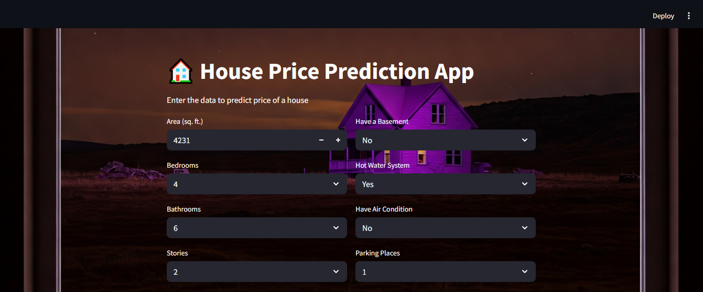

# 🏡 House Price Estimator

This project is a machine learning-based web application that predicts the selling price of a house based on various features such as area, bedrooms, bathrooms, and other amenities. It is powered by a regression model trained on a housing dataset and deployed using **Streamlit**.

---
## 🚀 Demo

---
## 📌 Features

- Predict house prices based on inputs like:
  - Area (in sq. ft.)
  - Number of bedrooms, bathrooms, and stories
  - Access to the main road
  - Guest room availability
  - Basement, air conditioning, hot water system
  - Preferred area status
  - Furnishing status
- Scales the input features using `StandardScaler`
- Uses `log1p` transformation on price and area during training
- Inverses transformation to return predicted price in the original scale
- Clean and styled UI using Streamlit

---
## 🛠️ Technologies Used

- Python
- Scikit-learn
- Pandas, NumPy
- Streamlit
- Joblib (for saving/loading models)
- Google Colab (for training)
- VS Code + Anaconda (for UI development)

---
## 🧠 Machine Learning Model

- **Algorithm:** Linear Regression (or your selected regressor)
- **Preprocessing:**
  - Categorical variables encoded (manual mapping)
  - Outliers handled using the IQR method
  - Applied `log1p` transformation on skewed features (`price`, `area`)
  - Features scaled with `StandardScaler`
- **Evaluation Metrics:**
  - MSE
  - RMSE
  - R² Score
---
## 🖥️ How to Run Locally

1) Download all the files and save them in a folder, i.e, Projects.
2) Open Anaconda Prompt and get the system control to your directory.
3) Create and activate a virtual environment using the following command
    - conda create -n House_price python=3.10
    - conda activate House_price
4) Install all the libraries and dependencies in your environment
    - pip install streamlit numpy scikit-learn joblib
5) Open the "streamlit_app" file in your VS Code and run the following command in the terminal
   - streamlit run streamlit_app.py
  
## 📝 Author

- **Muhammad Maaz**
- 📧 m.maazff37@gmail.com
- [LinkedIn Profile](https://www.linkedin.com/in/muhammad-maaz-0b858b22b/)
- [GitHub Profile](https://github.com/Cptn-maaz/)
